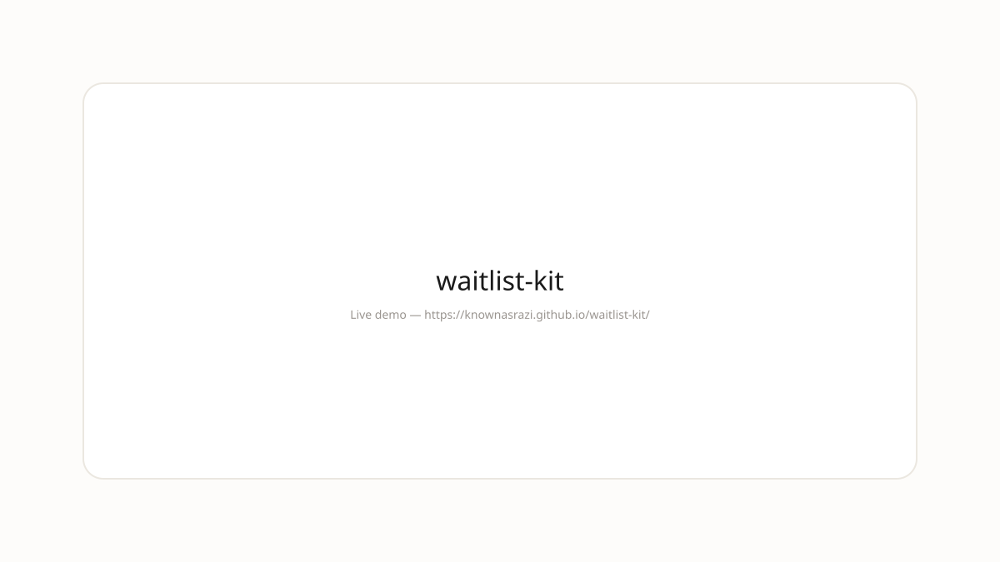

>   

---
## Demo



**Live:** https://knownasrazi.github.io/waitlist-kit/

> Screenshot is a placeholder — Pages deploys on push to `main`.

---


# waitlist-kit — Collect your first 1000.

Waitlist kit with email capture, referral, and Resend-ready API.

---

## Changelog-aware

This README is the changelog. Every release is a commit.

**v1.0.0** — Initial clean release. Next.js + Resend core, stone tokens, and a clean surface.

## Install

```bash
git clone https://github.com/knownasrazi/waitlist-kit.git
cd waitlist-kit
bun install && bun run dev
```

## Why clean?

Because tools should feel like paper. Clean is paper that has lived a little.

## License

MIT — [Razi](https://github.com/knownasrazi)
